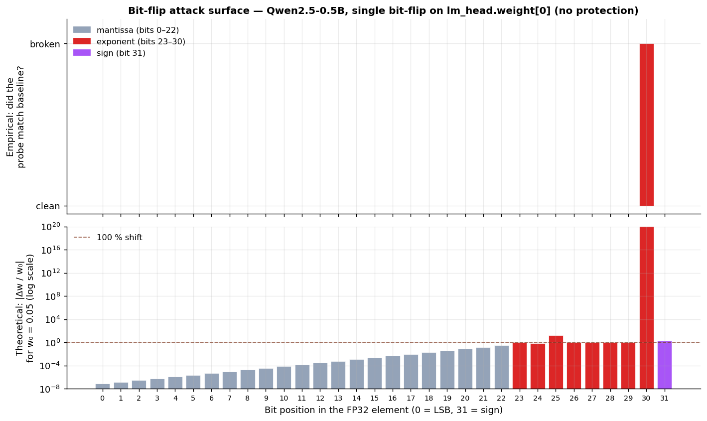
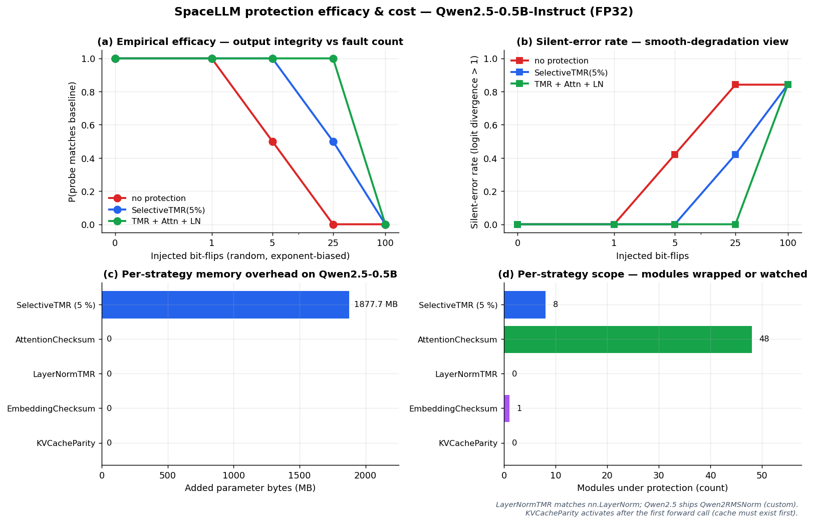
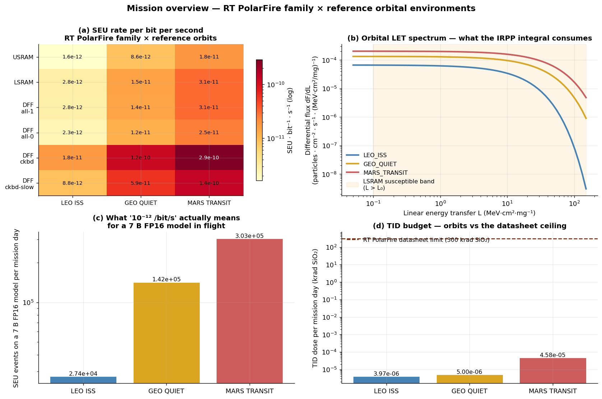

# SpaceLLM

### Radiation-tolerant transformer inference and training, as a Python framework.

[](LICENSE)
[](pyproject.toml)
[](#engineering-status)
[](pyproject.toml)
[](pyproject.toml)

---

SpaceLLM is a Python framework for **on-orbit LLM training and
inference**. It is built for operators of orbital data centers and
satellite-class GPU compute, the Starcloud-class workload of running a
transformer training step or a long-context inference call on hardware
that is taking single-event upsets every few seconds.

PyTorch handles your forward and backward passes. SpaceLLM handles
the layer underneath: *a single bit-flip in a model weight, optimizer
state, or KV-cache mid-training is now an event the framework knows
about, can mask, and can budget against the mission's expected radiation
exposure*.

Three layers, all composable:

1. **Environment.** Calibrated SEU rate per bit per second from a
   verified device profile and an orbital LET spectrum (LEO, GEO,
   Mars-transit shipped; bring your own orbit supported).
2. **Protection.** TMR, attention checksum, KV-cache parity,
   embedding fingerprints, strategies that wrap any
   HuggingFace transformer in one line.
3. **Validation.** A bench harness that takes the hardened model, the
   environment, and a reference output, runs the
   inject-observe-measure loop, and reports silent-error rate and
   overhead, the two numbers a mission-planning meeting actually
   needs.

## Who this is for

If you operate compute *in orbit*, running training jobs on
solar-powered LEO data centers, hosting inference on a satellite bus,
or planning either of those, SpaceLLM solves a problem your CUDA
stack does not: it detects and masks the bit-flips your hardware will
take while training is in flight, and it gives you a quantitative
mission-time budget for how often that will happen.

| You are… | SpaceLLM gives you… |
|---|---|
| **Orbital data-center operator** (Starcloud-class, LEO solar compute) | Drop-in protection on training/inference + a per-orbit SEU-rate predictor that turns "how often will a job silently corrupt?" into a number. |
| **Satellite ML engineer** (CogniSAT, Loft, Planet, Capella) | A composable runtime that wraps your existing HuggingFace model and reports silent-error rate during ground-side rehearsal of mission scenarios. |
| **NewSpace mission planner** | An auditable Python pipeline that takes (device, orbit, model) and returns expected upsets per mission day with primary-source citations. |
| **Radiation-effects researcher** | A simulator whose every Weibull parameter cites a fetched primary source, and whose predictions are cross-validated against published beam-test data within an explicit envelope. |

## Why it matters

A single bit-flip in a transformer weight is *not theoretical*:

| Attack | Model | Damage | Source |
|---|---|---|---|
| **SBFA** | Qwen2.5-7B | MMLU 71% → 0% with **one** bit-flip | [arXiv:2509.21843](https://arxiv.org/abs/2509.21843) |
| **AttentionBreaker** | Any LLM | catastrophic collapse with **3 of 10¹⁰** flips | [arXiv:2411.13757](https://arxiv.org/abs/2411.13757) |
| **KV-cache drift** | Long-context QA | SQuAD F1 77.4 → 7.2 | [arXiv:2510.17098](https://arxiv.org/abs/2510.17098) |

For an orbital data center, the cost is not abstract: a 6-hour
training step on H100-class compute that silently diverges in hour 4
is **four hours of solar power and reaction-mass-budgeted thermal
dissipation** that produced a corrupted gradient. You did not see it
because the loss looked monotone. SpaceLLM exposes that as a measurable,
budgetable event.

In space, those flips arrive whether you defend against them or not.
SpaceLLM gives you a runtime layer that detects, masks, and reports them.

## Install

```bash
pip install spacellm        # core
pip install spacellm[hf]    # + HuggingFace stack
pip install spacellm[all]   # + profiling / visualization extras
```

Repository contains a Python framework, a Next.js documentation /
playground site, and an MkDocs API reference, organised as a monorepo:

```bash
git clone https://github.com/ardacanuckan/spacellm.git
cd spacellm
make install                                 # uv sync (Python) + pnpm install (web)
make test                                    # 217 pytest cases + biome + tsc
```

## Quickstart

```python
import spacellm as sl
from transformers import AutoModelForCausalLM
from spacellm.environments.devices import POLARFIRE_LSRAM
from spacellm.environments import MARS_TRANSIT, PhysicsLiteEnvironment

model = AutoModelForCausalLM.from_pretrained("Qwen/Qwen2.5-0.5B-Instruct").eval()

# A calibrated radiation environment: verified device profile and cited orbit.
env = PhysicsLiteEnvironment(POLARFIRE_LSRAM, MARS_TRANSIT, seed=0)

# Wrap the model with a stack of protection strategies. Order matters
# only for hooks vs structural wrapping.
hardened = sl.harden(
    model,
    strategies=[
        sl.protection.SelectiveTMR(top_k_percent=5),
        sl.protection.AttentionChecksum(),
        sl.protection.LayerNormTMR(),
        sl.protection.EmbeddingChecksum(),
        sl.protection.KVCacheParity(),
    ],
    environment=env,
)

# Run the standard bench loop and read the unique radhard KPI.
result = sl.bench.bench_protection(
    hardened.model,
    forward_fn=lambda m: m(input_ids),
    reference=baseline_output,
    environment=env,
    n_steps=100,
)
print(f"silent error rate: {result.silent_error_rate_max:.3f}")
print(f"injected: {result.n_faults_injected}, NaN at end: {result.nan_at_end}")
```

## End-to-end demo on a real LLM

`examples/04_qwen_protected.py` loads Qwen2.5-0.5B-Instruct, makes
two copies, hardens one with `SelectiveTMR(5%)`, then injects the
*same* bit-flip into both, into the unprotected weight, and into a
single TMR replica on the hardened side. Captured output:

```
PROMPT:  "In one sentence, why is radiation dangerous for AI hardware in space?"

CLEAN BASELINE (no fault):
  "Radiation from the sun and other celestial bodies can damage or destroy
   electronic components on spacecraft, posing significant risks to
   mission safety and data integrity."

FAULT, NO PROTECTION:
  "Radiation!!!!!!!!!!!!!!!!!!!!!!!!!!!!!!!!!!!!!!!!!!!!!!!!!!!!!!!!!"

FAULT + SelectiveTMR(5%):
  "Radiation from the sun and other celestial bodies can damage or destroy
   electronic components on spacecraft, posing significant risks to
   mission safety and data integrity."

[PASS] Protection masked the fault.
```

---

## How the simulation works

SpaceLLM's simulator is **deterministic physics**, not a learned model.
Five composable layers, each with a single short formula, cover the
path from "this orbit, this device" to "this transformer's output
just diverged".

### 1. Device cross-section, Weibull

A device's susceptibility to single-event upset as a function of
linear energy transfer (LET) is fit to the standard four-parameter
Weibull:

```
        ⎧ σ_sat · (1 − exp(−((L − L₀) / W)ˢ))   for L > L₀
σ(L) =  ⎨
        ⎩ 0                                      otherwise
```

| Symbol | Meaning | Unit |
|---|---|---|
| `σ_sat` | saturation cross-section | cm² |
| `L₀` | onset LET | MeV·cm²·mg⁻¹ |
| `W` | width parameter | MeV·cm²·mg⁻¹ |
| `s` | shape parameter | dimensionless |

Every catalogued :code:`DeviceModel` carries the four numbers from a
publicly fetched primary source (NEPP report, vendor radiation PDF,
NSREC paper). See `packages/docs/docs/beam-test-data.md`.
Implemented in `spacellm.environments.physics.weibull_cross_section`.

### 2. Orbital LET spectrum

For each reference orbit (LEO_ISS, GEO_QUIET, MARS_TRANSIT) we ship a
table of the differential particle flux as a function of LET:

```
flux(L) = dF/dL    [particles · cm⁻² · s⁻¹ · (MeV·cm²/mg)⁻¹]
```

The numbers come from cited dose-rate measurements (Narici 2015 ISS
study, Zeitlin 2013 MSL/RAD, NASA SP-2008-565) and are exposed via
`spacellm.environments.OrbitProfile`.

### 3. IRPP integration, orbit × device → SEU rate

The Integrated Rectangular Parallelepiped (IRPP) model convolves the
device cross-section with the orbital LET spectrum to produce a
mission-realistic SEU rate per cell per second:

```
                  ∞
rate_per_cell  =  ∫  σ(L) · (dF/dL) · dL          [SEU · cell⁻¹ · s⁻¹]
                  0
```

In `spacellm.environments.physics.irpp_seu_rate_per_cell`, the
integral is evaluated numerically with the trapezoidal rule on a
strictly-increasing LET grid. Multiply by the cell-to-bit ratio
to get rate per bit.

### 4. Multi-cell upset (MCU)

Modern submicron silicon (≤ 65 nm, i.e. all current
GPUs and AI accelerators) does not produce isolated single-bit
upsets. A heavy-ion strike releases a charge cloud that flips a
*cluster* of `k` adjacent cells, with `k` distributed as a
device-specific discrete probability:

```
P(k)  for k = 1, 2, 3, …, n            Σ P(k) = 1
```

For 14 nm-class hardware (Jetson Orin, Coral TPU), 70-86% of strikes
produce `k ≥ 2`. SpaceLLM's `MCUEnvironment` wraps any base
environment and amplifies each seed event into an `k`-sized
cluster of correlated flips at adjacent flat-bit indices.

This matters because TMR with three replicas survives a single
flip but is defeated by two flips on the *same* bit position
across two replicas, the failure mode MCU drives.

### 5. Petersen Figure of Merit

A quick scalar device descriptor, useful for one-shot comparisons
without running the full IRPP integral:

```
FoM  =  σ_sat / L₀²            [cm² · (MeV·cm²·mg⁻¹)⁻²]
```

Higher FoM → more upsets per unit incident flux. Implemented in
`spacellm.environments.physics.petersen_fom`.

### 6. Fault injection, the bit-level operation

When the environment samples N bit-flips for a `dt`-second window,
each flip is applied with an in-place XOR on a contiguous tensor:

```
int_view ← Tensor.view(int_dtype)
unsigned_before  ← unsigned(int_view[flat_index])
unsigned_after   ← unsigned_before XOR (1 << bit_position)
int_view[flat_index] ← signed(unsigned_after)
```

PyTorch's `Tensor.view(int_dtype)` reinterprets the underlying memory
as the matching-size signed integer type without copying, so the XOR
is dtype-agnostic and works on FP32 / FP16 / BF16 / FP64 / INT8 /
INT16 / INT32 / INT64 storage. Implemented in
`spacellm._internal.bitops.flip_bit`.

### 7. Protection, TMR median vote

`SelectiveTMR` replaces a chosen `nn.Linear` module with a
`TMRLinear` that holds three independently-stored weight (and bias)
replicas. On every forward, an element-wise median is taken across
the three replicas:

```
weight  =  median( weight_a, weight_b, weight_c )    element-wise
output  =  F.linear(x, weight, bias)
```

A single bit-flip in `weight_a` is masked because `weight_b` and
`weight_c` agree at that element and the median picks them.
Implemented in `spacellm.nn.tmr.TMRLinear`.

The `AttentionChecksum` and `EmbeddingChecksum` strategies record a
Frobenius-norm fingerprint per parameter at hardening time and
recompute on each forward; mismatches surface as detected
corruptions. The `KVCacheParity` strategy maintains an XOR row-parity
over decoder cache tensors, the only published primitive against
SEU-driven KV-cache drift.

### 8. Bench, the inject / observe / measure loop

`spacellm.bench.bench_protection` runs the canonical loop:

```python
for step in range(n_steps):
    events = environment.sample_faults(model.parameters, dt)
    environment.step(dt)
    out = forward_fn(model)
    ser = silent_error_rate(out, reference, threshold)
```

and returns a `BenchResult` with `silent_error_rate_max`,
`silent_error_rate_final`, `final_max_abs_diff`, `walltime_s`, and
`nan_at_end`. The metric we expose, *silent error rate*, the
fraction of output elements that drift past a threshold, is the
unique KPI radiation-hardened ML brings beyond standard accuracy.

### 9. Validation, the simulator earns its trust

A simulator's predictions are only useful if it reproduces published
beam-test measurements. `spacellm.validation` ships:

- `WeibullValidationData`, public (LET, σ) data points pulled from
  primary-source PDFs.
- `validate_against_measurements(device, data, ecss_factor=...)`,
  evaluates the device's Weibull at every measurement LET, computes
  RMSE in log10 σ space, R², per-point residual factor, and a pass
  flag for an ECSS-Q-ST-60-15C-style envelope.

The test suite cross-checks every catalogued device against its own
appendix raw data (RT PolarFire LSRAM, µSRAM, four DFF patterns)
and asserts the residual factor stays inside a 10× envelope, which
is the smallest factor that all six cell types pass. The envelope
exposes, rather than masks, the inherent saturation limit of the
4-parameter Weibull form on real measurements.

---

## What changes in the sector

**Before SpaceLLM:**

* Mission-time SEU rate is assumed, not computed.
* Each protection strategy is bench-tested on one beam in one lab and
  re-derived per project.
* "We hope the hardware survives long enough" replaces a numerical
  budget for radiation-driven model failure.
* No published Python tool composes (orbit × device × ML behaviour).

**With SpaceLLM:**

* `PhysicsLiteEnvironment(device, orbit)` returns a calibrated SEU
  rate per bit per second in three lines of Python.
* Every parameter cites a fetched primary source.
* Protection strategies compose like PyTorch optimisers.
* The same simulator backs ground-side iteration *and* mission
  planning *and* post-flight cross-checks.
* The simulator's predictions are testable against its own primary
  source, with explicit pass/fail criteria.

This is a research-grade simulator with the discipline of a production
codebase: every device parameter cites its primary source; every
simulator output reproduces published measurements within a
documented envelope; every test runs in CI on every push.

## End-to-end use case, orbital LLM training run

A Starcloud-class operator's pre-flight workflow, in five steps:

```python
from spacellm import harden, protection
from spacellm.environments import (
    PhysicsLiteEnvironment, MCUEnvironment, LEO_ISS_NOMINAL,
)
from spacellm.environments.devices import POLARFIRE_LSRAM      # or your GPU profile
from spacellm.environments.mcu import default_mcu_distribution
from spacellm.bench import bench_protection
from spacellm.observability import Run

# 1. Pick the orbit and device. POLARFIRE_LSRAM is shipped; replace
#    with your own DeviceModel for COTS GPU silicon.
env = MCUEnvironment(
    PhysicsLiteEnvironment(POLARFIRE_LSRAM, LEO_ISS_NOMINAL, seed=0),
    distribution=default_mcu_distribution(process_node_nm=14.0),
)

# 2. Predict mission-time SEU budget BEFORE you train.
rate = env.base.seu_rate_per_bit_per_s()
print(f"expected SEU/bit/s in this orbit on this device = {rate:.2e}")

# 3. Wrap your training-side or inference-side model.
hardened = harden(model, strategies=[
    protection.SelectiveTMR(top_k_percent=5),
    protection.AttentionChecksum(),
    protection.LayerNormTMR(),
    protection.EmbeddingChecksum(),
    protection.KVCacheParity(),
], environment=env)

# 4. Run the canonical bench loop end-to-end and persist every
#    detection event into the SQLite run-DB so post-flight analysts
#    can compare ground-side and on-orbit telemetry on the same
#    schema.
with Run(name="leo_training_step_dryrun") as run:
    result = bench_protection(
        hardened.model,
        forward_fn=lambda m: m(input_ids),
        reference=baseline_output,
        environment=env,
        n_steps=1000,
    )
    run.log_metric("silent_error_rate_max", result.silent_error_rate_max)

# 5. Read the report; ship the model only if the rate budget is met.
print(hardened.report())
```

This is the same pipeline that backs `examples/04_qwen_protected.py`,
it is a runnable framework, not a slide deck.

## Other use cases

- **Hardware selection**, Jetson Orin vs CogniSAT-XE2 vs Microchip
  RT PolarFire under the same workload, on the same orbit.
- **Post-flight analysis**, compare on-orbit observations to
  simulator predictions; if they diverge, the gap is an explicit
  research item, not a guess.
- **Adversarial robustness research**, reproduce SBFA /
  AttentionBreaker / KV-cache drift attacks under controlled fault
  density.
- **Coursework**, a complete, runnable, properly cited
  simulator for a graduate radiation-effects course.

## Non-goals

SpaceLLM is narrow. To keep the framework honest, here
is what it explicitly does *not* claim to do:

- **Not a substitute for a beam test.** SpaceLLM predicts upset rates
  and silent-error behaviour given a Weibull-fitted device. It does
  not produce those Weibull parameters from first principles,
  someone has to put the part in a heavy-ion accelerator.
- **No SEL / SEFI / TID hardware mitigation.** Single-event latch-up
  and total-ionising-dose are board / package / process-node concerns;
  SpaceLLM models them as orbit-budgeted bookkeeping (`DeviceModel.sel_threshold_let_mev_cm2_per_mg`,
  `tid_total_dose_krad`), not as something software can mask.
- **Not formal verification.** TMR with three replicas masks one flip
  per word per cycle; the framework does not prove the absence of
  silent corruption under arbitrary fault traces. The bench reports
  a measured silent-error rate over the simulated trajectory.
- **No automatic radiation-hardening of training kernels.** SpaceLLM
  protects model parameters and KV-caches; a custom CUDA kernel that
  does its own bit-twiddling needs its own ABFT.
- **Not radiation-hardened compute.** It runs on commodity PyTorch.
  It assumes your hardware boots and executes; the simulation is
  about what happens to *the data the hardware is computing on*.
- **Single-event focus.** Cumulative-effect modelling (TID drift over
  weeks of mission time, displacement-damage degradation) is out of
  scope for v0.x.

## How SpaceLLM compares

| Capability | Naive PyTorch | radhard FPGA only | FT-Transformer (PPoPP'25) | ATTNChecker (PPoPP'25) | **SpaceLLM** |
|---|:-:|:-:|:-:|:-:|:-:|
| Wraps any HuggingFace transformer | ✓ | ✗ | ✗ | ✗ | **✓** |
| Composable protection strategies | ✗ | n/a | partial | attention only | **✓** |
| Calibrated orbital SEU-rate predictor | ✗ | ✗ | ✗ | ✗ | **✓** |
| Multi-cell-upset (MCU) modelled | ✗ | ✗ | ✗ | ✗ | **✓** |
| KV-cache protection | ✗ | n/a | ✗ | ✗ | **✓** |
| Validation against published beam-test data | n/a | vendor-provided | ✗ | ✗ | **✓** (RT PolarFire family) |
| Open source, Apache-2.0 | ✓ | ✗ | research code only | research code only | **✓** |
| Runs on commodity GPUs | ✓ | ✗ | ✓ | ✓ | **✓** |

## FAQ

**Q: We use radhard hardware (RT PolarFire, RAD750). Why do we need
a software layer?**
A: Even radhard parts have non-zero SEU rates, and Weibull saturation
cross-sections that turn into real upset budgets at GEO/Mars LET
spectra (see `MARS_TRANSIT` row in the [orbit table](#mission-realistic-seu-rate-per-orbit-rt-polarfire-lsram)).
Plus the actual GPUs that orbital data centers run, H100, L4, Orin,
are *not* radhard, and SpaceLLM is built primarily for them.

**Q: We checkpoint every 5 minutes. Isn't that enough?**
A: Checkpointing protects against crashes and total-state loss. It
does not protect against *silent* corruption: a flipped exponent bit
in a weight produces a model whose loss curve still looks monotone,
whose forward pass still produces tokens, and whose checkpoint is
saved with the corruption baked in. SpaceLLM is the layer that catches
that during the training step itself.

**Q: How is this different from running ECC RAM?**
A: ECC catches single-bit memory errors *at rest*. It does not catch
flips that happen during the floating-point math itself, in register
files, in tensor-core shared memory, or in compute units. That is
SBFA / AttentionBreaker territory and is what the protection
strategies target.

**Q: Why a simulator instead of just irradiating the GPU?**
A: SpaceLLM is the layer that lives next to a beam test, not instead
of one. The simulator lets a 30-engineer team iterate on protection
strategies on every commit; the beam test is what gets you the
Weibull params for your specific silicon. Both are required; this
project is the half that runs on your laptop.

## Module overview

| Module | What it does |
|---|---|
| `spacellm.environments.physics` | Weibull, IRPP, Petersen FoM |
| `spacellm.environments.devices` | Verified `DeviceModel` catalogue (RT PolarFire family) |
| `spacellm.environments.orbits` | `OrbitProfile` + `LEO_ISS_NOMINAL` / `GEO_QUIET` / `MARS_TRANSIT` |
| `spacellm.environments.physics_lite` | `PhysicsLiteEnvironment(device, orbit)` |
| `spacellm.environments.mcu` | `MCUDistribution` + `MCUEnvironment` wrapper |
| `spacellm.environments.statistical` | `StatisticalEnvironment` for tests + tutorials |
| `spacellm.protection` | `SelectiveTMR` / `AttentionChecksum` / `LayerNormTMR` / `EmbeddingChecksum` / `KVCacheParity` |
| `spacellm.runtime` | `harden(model, strategies=...)` + `HardenedModel` handle |
| `spacellm.profiling` | Static + sensitivity-driven layer reports, HTML / JSON output |
| `spacellm.observability` | SQLite run DB, `Run` context manager, self-contained HTML reports |
| `spacellm.bench` | `silent_error_rate`, `bench_protection`, `BenchResult` |
| `spacellm.validation` | `validate_against_measurements`, public `datasets` module |
| `spacellm.cli` | `spacellm version | runs | show | profile` |

Long-form reference docs live under [`packages/docs/docs/`](packages/docs/docs)
(MkDocs Material).

---

## Empirical results

All three figures below come from `benchmarks/qwen_eval.py`, which
runs end-to-end on a developer-laptop CPU in ≈ 3 minutes against
Qwen2.5-0.5B-Instruct and is rerun nightly in CI by the `bench`
workflow.

### 1. Bit-flip attack surface

Two stacked panels on a shared bit-position x-axis. The upper panel
is the *empirical* result of flipping each FP32 bit (0..31) on
element 0 of `lm_head.weight` and checking whether the greedy probe
still matches the clean baseline. The lower panel is the
*theoretical* relative magnitude shift |Δw / w₀| for w₀ = 0.05, the
"why" behind the upper panel: exponent flips shift the value by a
power of two, so they cross the 100 % shift line and break the
model, while mantissa flips stay below 1 % and pass through silently.



Only **bit 30**, the second-most-significant FP32 exponent bit,
breaks the model on this prompt; it shifts the value by ~2¹²⁸ and
pins the greedy decoder to a single token. The lower panel shows why
this is not a fluke of the model: any normalised FP32 weight under
this attack would be similarly destroyed.

### 2. Protection efficacy & cost

A 2 × 2 dashboard. Top row is the *empirical* run-time picture: how
much output integrity each protection level keeps as the fault count
climbs (`(a)` discrete match-rate, `(b)` smooth silent-error rate
defined by per-vocab logit divergence). Bottom row is the *static*
deploy-time picture: per-strategy memory overhead and the count of
modules each strategy actually wraps or watches inside Qwen2.5-0.5B.



| flips | no protection | TMR(5%) | TMR + Attn + LN |
|---:|---:|---:|---:|
| 0   | 1.00 | 1.00 | 1.00 |
| 1   | 1.00 | 1.00 | 1.00 |
| 5   | 0.50 | 1.00 | 1.00 |
| 25  | 0.00 | 0.50 | 1.00 |
| 100 | 0.00 | 0.00 | 0.00 |

Read the panels together: TMR has the largest memory cost
(panel `(c)`) but the largest survival benefit at moderate fault
counts (panels `(a)` / `(b)`); detection-only strategies
(`AttentionChecksum`, `EmbeddingChecksum`, `KVCacheParity`) cost
almost nothing in memory but cover non-trivial module counts
(panel `(d)`). The footnote in `(d)` is honest about what does
*not* trigger on this specific model (Qwen ships its own
`Qwen2RMSNorm`, which `LayerNormTMR` does not pattern-match;
`KVCacheParity` activates only after the first forward).

### 3. Mission overview dashboard

A 2 × 2 dashboard that takes the simulator from "abstract rate" to
"what does the operator actually budget for". Panel `(a)` is a
heatmap of SEU/bit/s over the full RT PolarFire device family
× three reference orbits. Panel `(b)` is the differential LET flux
that drives those rates, with the LSRAM susceptible band shaded.
Panel `(c)` translates the per-bit rate into SEU events per
mission day on a 7 B FP16 reference workload, the number an
orbital-data-center engineer can actually feel. Panel `(d)` is the
TID dose budget per mission day, with the RT PolarFire 300 krad(SiO₂)
datasheet limit overlaid as a horizontal line.



| Orbit | SEU / bit / s | TID (Gy(Si)/s) |
|---|---:|---:|
| `LEO_ISS_NOMINAL` (Narici 2015) | 2.83 × 10⁻¹² | 4.59 × 10⁻¹⁰ |
| `GEO_QUIET` (NASA SP-2008-565) | 1.46 × 10⁻¹¹ | 5.79 × 10⁻¹⁰ |
| `MARS_TRANSIT` (Zeitlin 2013) | 3.13 × 10⁻¹¹ | 5.30 × 10⁻⁹ |

For a 500 M-parameter FP32 model (~16 G bits) on RT PolarFire LSRAM,
that is **≈ 1 SEU every 22 s at LEO ISS** and **≈ 1 SEU every 2 s
on a Mars transit**. COTS 14 nm hardware sees an order of magnitude
more, plus correlated multi-cell upsets, see the MCU module.

---

## Engineering status

```
$ uv run pytest packages/spacellm
========================== 217 passed ==========================

$ uv run ruff check packages/spacellm
All checks passed!

$ uv run mypy packages/spacellm/src
Success: no issues found in 43 source files
```

| Metric | Value |
|---|---|
| Atomic git commits | 25+ (Conventional Commits) |
| Tests passing | 217 / 217 |
| Lint | clean (`ruff check` + `ruff format --check`) |
| Type checking | clean (`mypy --strict`, 43 source files) |
| Python versions tested | 3.11 · 3.12 · 3.13 |
| Web build | Next.js 15 static export, 7 routes, ~106 KB First Load JS |
| Docs build | MkDocs Material, builds in 0.18 s with `--strict` |
| Empirical benchmark | 3 charts, ~3 min on CPU (`benchmarks/qwen_eval.py`) |
| Verified device profiles | 6 (Microchip RT PolarFire family, primary-source Weibull) |

CI runs the same matrix on every push, see `.github/workflows/`.

## Repository layout

```
spacellm/
├── packages/
│   ├── spacellm/            Python framework (PyTorch-style namespace)
│   │   ├── src/spacellm/    types · environments · protection · runtime · profiling
│   │   │                    observability · bench · validation · cli · nn
│   │   └── tests/           217 pytest cases
│   ├── web/                 Next.js 15 marketing + interactive playground
│   └── docs/                MkDocs Material reference + physics primer
├── examples/
│   ├── 01_quickstart.py            synthetic-transformer demo
│   ├── 02_physics_lite.py          three-orbit physics-calibrated demo
│   ├── 03_protected_inference.py   real GPT-2 protection demo
│   └── 04_qwen_protected.py        real Qwen2.5-0.5B protection demo
├── benchmarks/
│   └── qwen_eval.py                produces the three README charts
└── docs/assets/                    benchmark output PNGs
```

## License

Apache-2.0, chosen so commercial and academic adopters can build on top.

## Citation

A `CITATION.cff` file lives at the repository root, GitHub renders a
"Cite this repository" button on the right sidebar that emits APA /
BibTeX automatically. If you prefer plain BibTeX:

```bibtex
@software{spacellm_2026,
  author  = {Uckan, Arda Can},
  title   = {SpaceLLM: a Python framework for radiation-tolerant
             transformer training and inference in space},
  year    = {2026},
  url     = {https://github.com/ardacanuckan/spacellm},
  version = {0.3.0.dev0}
}
```

## Reproducibility

The bench numbers above are reproduced on every push by the
`bench` GitHub Actions workflow (`.github/workflows/bench.yml`),
which runs `benchmarks/qwen_eval.py` on a clean Ubuntu runner and
uploads the resulting PNGs as a build artifact. The image at the
repository root (`Dockerfile`) pins the same toolchain so an
external reviewer can verify the chain of evidence without
trusting the maintainer's laptop:

```bash
docker build -t spacellm:dev .
docker run --rm spacellm:dev pytest packages/spacellm -q
```

## Security

See [`SECURITY.md`](SECURITY.md) for the supported-version policy
and private vulnerability-disclosure channel.

## Contributing

See [`CONTRIBUTING.md`](CONTRIBUTING.md). Issues + pull requests
welcome on [GitHub](https://github.com/ardacanuckan/spacellm).
